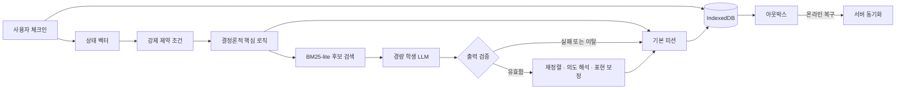

<p align="center">
  <a href="#introduction">
    
  </a>
</p>
<p align="center">
  <br />
  <a href="#introduction"><strong>Introduction</strong></a> ·
  <a href="#architecture"><strong>Architecture</strong></a> ·
  <a href="#model-optimization"><strong>Model Optimization</strong></a> ·
  <a href="#validation"><strong>Validation</strong></a>
</p>

<p align="center">
  
  
  
  
</p>

## Introduction

ReNew는 네트워크 연결이 불안정하고 단말 성능이 낮은 환경에서도 **체크인 → 미션 → 회고**의 핵심 흐름을 유지하는 생활·정서 지원 시스템입니다. 브라우저에서 실행하는 1B급 언어 모델을 저비트 양자화, 구조 축소, 지식 증류로 경량화하고, 모델이 실행되지 않는 상황에도 서비스가 계속되도록 결정론적 추천 로직과 로컬 우선 저장 계층을 결합했습니다.

이 프로젝트의 핵심 질문은 “모델을 얼마나 줄일 수 있는가?”가 아니라 **“모델이 실패해도 무엇이 반드시 남아야 하는가?”**입니다.

## Key Features

| 기능 | 설명 |
| --- | --- |
| 오프라인 우선 흐름 | 네트워크가 없어도 체크인, 미션 선택, 회고 저장을 이어갑니다. |
| 결정론적 미션 선택 | 검수된 활동에 강제 제약을 적용한 뒤 수행 가능성 70%, 시간 적합도 30%로 기본 미션을 선택합니다. |
| 경량 브라우저 LLM | 4비트 양자화와 구조 축소로 가중치와 KV 캐시 부담을 줄입니다. |
| 제한된 LLM 역할 | 후보 재정렬, 3단계 의도 분류, 문장 표현 보정에만 모델을 사용합니다. |
| 안전한 대체 경로 | 모델 로딩 실패, 파싱 실패, 후보 이탈 시 결정론적 결과를 그대로 사용합니다. |
| 로컬 우선 동기화 | IndexedDB에 먼저 기록하고 아웃박스가 재연결 후 중복 없이 동기화합니다. |

## Architecture

ReNew는 핵심 기능을 모델에 종속시키지 않습니다. 결정론적 로직과 로컬 저장소가 기본 흐름을 책임지고, 증류한 경량 학생 LLM은 품질을 높이는 선택 계층으로만 동작합니다.



### 역할 분리

| 계층 | 책임 | 실패 시 동작 |
| --- | --- | --- |
| 결정론적 핵심 | 제약 적용, 적합도 계산, 기본 미션 선택 | 항상 동일한 기본 경로 유지 |
| 로컬 저장 | 체크인·미션·회고 상태 보존 | 브라우저 재시작 후 상태 복원 |
| 경량 학생 LLM | 후보 재정렬, `smaller / keep / bigger` 분류, 표현 보정 | 결과를 버리고 기본 미션 사용 |
| 아웃박스 | 미동기화 작업 보관과 재전송 | 연결 복구 후 중복 없이 동기화 |

## Model Optimization

브라우저 추론의 최대 메모리는 가중치 하나로 결정되지 않습니다.

```text
M_peak ≈ M_weights + M_KV + M_activations + M_runtime + M_allocator
```

ReNew는 각 메모리 항을 서로 다른 방법으로 줄였습니다.

1. **저비트 양자화** — `q0f16`에서 `q4f16_1`로 전환해 가중치 메모리를 축소했습니다.
2. **구조 축소** — 레이어 수, 은닉 차원, 어텐션 헤드를 줄여 파라미터와 KV 캐시를 함께 낮췄습니다.
3. **교사-학생 지식 증류** — 미션 재정렬, 3단계 의도 분류, 문장 표현 품질을 보완했습니다.
4. **역할 제한** — 모델이 새로운 행동을 자유 생성하지 않고 검수된 후보 안에서만 보조하도록 제한했습니다.

Llama 3.2 1B는 약 1.236B 파라미터이며, 4K 문맥의 FP16 KV 캐시는 약 128 MiB입니다. 동일한 4K 조건에서 양자화 적용 결과는 다음과 같습니다.

| 구성 | 요구 VRAM | 변화 |
| --- | ---: | ---: |
| `q0f16` | 2,573.13 MB | 기준 |
| `q4f16_1` | 879.04 MB | 약 65.84% 감소 |

양자화는 가중치 부담을 크게 낮추지만 모델 구조와 KV 캐시를 직접 줄이지는 못합니다. 이 때문에 ReNew는 양자화된 원본 모델에 머물지 않고 구조를 축소한 학생 모델과 지식 증류를 함께 사용했습니다.

## Decision Policy

사용자가 수면, 에너지, 사회적 부담, 활동 시작 난이도를 입력하면 시스템은 이를 상태 벡터로 변환합니다. 시간·비용·대인 부담처럼 현재 상태에 맞지 않는 활동을 먼저 제외하고, 남은 검수된 활동에 다음 비율을 적용해 기본 미션을 결정합니다.

```text
mission_score = feasibility × 0.70 + time_fit × 0.30
```

학생 LLM의 결과가 허용 후보를 벗어나거나 파싱되지 않으면 해당 결과는 채택하지 않습니다. 따라서 모델은 추천 품질을 개선할 수 있지만 핵심 결정권을 독점하지 않습니다.

## Validation

모델 경량화와 서비스 지속성을 서로 다른 검증 축으로 평가했습니다.

| 검증 축 | 수행 내용 | 확인 결과 |
| --- | --- | --- |
| 저비트 양자화 | `q0f16 → q4f16_1` | VRAM 2,573.13 → 879.04 MB |
| 구조 축소 | 레이어·은닉 차원·어텐션 헤드 축소 | 파라미터와 KV 부담 동시 감소 |
| 지식 증류 | 교사 모델 → 경량 학생 모델 | 재정렬·의도 분류·표현 품질 보완 |
| 역할 제한 | 허용 후보 안에서만 LLM 사용 | 자유 생성 우회 차단 |
| 네트워크 단절 | IndexedDB 우선 저장 | 체크인과 회고 보존 |
| LLM 로딩 실패 | 결정론적 대체 경로 실행 | 기본 미션 선택 유지 |
| WebGPU 미지원 | LLM 계층 우회 | 핵심 사용자 흐름 유지 |
| 탭 재시작 | 로컬 상태 복원 | 세션 진행 상태 복구 |
| 네트워크 재연결 | 아웃박스 재전송 | 중복 없는 서버 동기화 |

하나의 세션은 체크인이 로컬에 저장되고, 미션이 제시되며, 회고가 보존되고, 재연결 뒤 서버에 중복 없이 동기화될 때 성공한 것으로 정의했습니다.

## Technical Scope

- 경량 LLM은 검수된 후보 안의 재정렬·의도 해석·표현 보정만 수행합니다.
- 모델이 정상 동작하지 않아도 핵심 기능은 결정론적 로직으로 유지됩니다.
- 민감한 기록은 연결 여부와 무관하게 로컬 저장을 우선합니다.
- 이 README는 연구 포트폴리오 자료의 설계와 검증 결과를 기준으로 정리했습니다. 공개 코드와 모델 아티팩트가 연결되면 재현 가능한 설치·실행 절차를 추가할 수 있습니다.

---

<p align="center">
  <strong>ReNew</strong><br />
  <sub>작은 모델보다, 실패해도 지속되는 시스템</sub>
</p>
