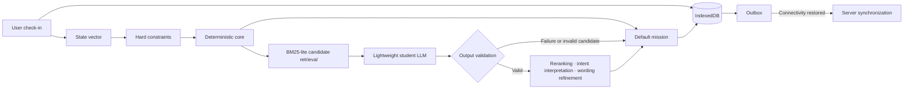

<p align="center">
  <a href="#introduction">
    
  </a>
</p>
<p align="center">
  <br />
  <a href="#introduction"><strong>Introduction</strong></a> ·
  <a href="#architecture"><strong>Architecture</strong></a> ·
  <a href="#model-optimization"><strong>Model Optimization</strong></a> ·
  <a href="#validation"><strong>Validation</strong></a>
</p>

<p align="center">
  
  
  
  
</p>

## Introduction

ReNew is a daily-life and emotional well-being support system designed to preserve the core **check-in → mission → reflection** flow on low-end devices and unreliable networks. It combines a browser-based 1B-class language model—optimized through low-bit quantization, structural reduction, and knowledge distillation—with deterministic recommendation logic and local-first storage so the service can continue even when the model cannot run.

The project is not centered on the question, “How small can the model become?” Instead, it asks: **“What must remain when the model fails?”**

## Key Features

| Feature | Description |
| --- | --- |
| Offline-first flow | Check-ins, mission selection, and reflections continue without a network connection. |
| Deterministic mission selection | Hard constraints are applied to reviewed activities, then the default mission is selected using 70% feasibility and 30% time fit. |
| Lightweight browser LLM | 4-bit quantization and structural reduction lower the memory cost of weights and the KV cache. |
| Constrained LLM role | The model is used only for candidate reranking, three-level intent classification, and wording refinement. |
| Safe fallback path | When model loading or parsing fails—or the output leaves the allowed candidate set—the deterministic result is used unchanged. |
| Local-first synchronization | Data is written to IndexedDB first, then an outbox synchronizes it without duplication after connectivity returns. |

## Architecture

ReNew does not make its core functionality dependent on the model. Deterministic logic and local storage own the default flow, while a distilled lightweight student LLM acts only as an optional quality-enhancement layer.



### Separation of Responsibilities

| Layer | Responsibility | Behavior on failure |
| --- | --- | --- |
| Deterministic core | Applies constraints, calculates fit, and selects the default mission | Preserves the same default path |
| Local storage | Retains check-in, mission, and reflection state | Restores state after a browser restart |
| Lightweight student LLM | Reranks candidates, classifies `smaller / keep / bigger`, and refines wording | Discards the output and uses the default mission |
| Outbox | Stores and retries unsynchronized operations | Synchronizes without duplication after reconnection |

## Model Optimization

Peak memory during browser inference is not determined by model weights alone.

```text
M_peak ≈ M_weights + M_KV + M_activations + M_runtime + M_allocator
```

ReNew reduces each memory component through a different optimization strategy.

1. **Low-bit quantization** — Moving from `q0f16` to `q4f16_1` reduces weight memory.
2. **Structural reduction** — Reducing the number of layers, hidden dimensions, and attention heads lowers both parameter count and KV-cache usage.
3. **Teacher–student knowledge distillation** — Distillation improves mission reranking, three-level intent classification, and wording quality.
4. **Role restriction** — The model assists only within a reviewed candidate set instead of freely generating new actions.

Llama 3.2 1B contains approximately 1.236 billion parameters, and its FP16 KV cache for a 4K context is approximately 128 MiB. Under the same 4K context condition, quantization produced the following results.

| Configuration | Required VRAM | Change |
| --- | ---: | ---: |
| `q0f16` | 2,573.13 MB | Baseline |
| `q4f16_1` | 879.04 MB | Approximately 65.84% lower |

Quantization significantly reduces the weight footprint, but it does not directly shrink the model structure or KV cache. ReNew therefore goes beyond quantizing the original model by combining a structurally reduced student model with knowledge distillation.

## Decision Policy

The system converts user input about sleep, energy, social load, and difficulty initiating an activity into a state vector. It first removes activities that do not fit the current constraints—such as time, cost, or interpersonal burden—then selects the default mission from the remaining reviewed activities using the following score.

```text
mission_score = feasibility × 0.70 + time_fit × 0.30
```

If the student LLM output cannot be parsed or falls outside the allowed candidate set, it is rejected. The model can therefore improve recommendation quality without holding exclusive control over the core decision.

## Validation

Model optimization and service continuity were evaluated along separate validation axes.

| Validation axis | Procedure | Result |
| --- | --- | --- |
| Low-bit quantization | `q0f16 → q4f16_1` | VRAM reduced from 2,573.13 to 879.04 MB |
| Structural reduction | Reduced layers, hidden dimensions, and attention heads | Lower parameter and KV-cache cost |
| Knowledge distillation | Teacher model → lightweight student model | Improved reranking, intent classification, and wording quality |
| Role restriction | LLM operates only within the allowed candidate set | Prevented bypass through free generation |
| Network disconnection | IndexedDB-first persistence | Preserved check-ins and reflections |
| LLM loading failure | Deterministic fallback execution | Maintained default mission selection |
| WebGPU unavailable | Bypassed the LLM layer | Preserved the core user flow |
| Tab restart | Restored local state | Recovered session progress |
| Network reconnection | Retried through the outbox | Synchronized with the server without duplication |

A session is considered successful when the check-in is stored locally, a mission is presented, the reflection is preserved, and the data is synchronized to the server without duplication after reconnection.

## Technical Scope

- The lightweight LLM performs only reranking, intent interpretation, and wording refinement within the reviewed candidate set.
- Deterministic logic preserves the core functionality even when the model does not operate normally.
- Sensitive records are stored locally first, regardless of connectivity.
- This README summarizes the design and validation results documented in the research portfolio. Reproducible installation and execution instructions can be added when the public code and model artifacts become available.

---

<p align="center">
  <strong>ReNew</strong><br />
  <sub>Not just a smaller model, but a system that keeps working through failure.</sub>
</p>
